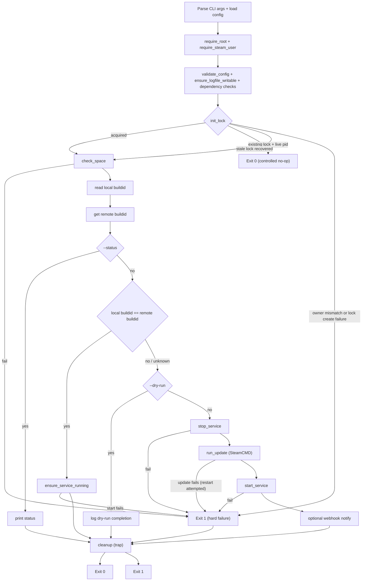
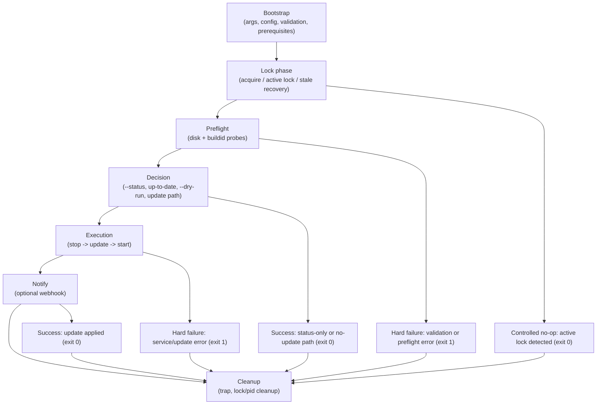

# CS2 Auto-Update

A robust, modular Bash script that keeps your Counter-Strike 2 dedicated server up to date. It checks the remote buildid via SteamCMD and only stops/updates/restarts the service when an update is required. Built-in logging, error handling, retries, and disk-space checks make it production-ready.

## Quick start

Replace `yourusername` with your GitHub username or org when cloning.

```bash
git clone https://github.com/yourusername/cs2-auto-update.git && cd cs2-auto-update
cp update_cs2.sh /home/steam/update_cs2.sh && chmod +x /home/steam/update_cs2.sh
# Optional: cp cs2-auto-update.conf.example /home/steam/cs2-auto-update.conf && edit
sudo crontab -e   # Add: 0 7 * * * /home/steam/update_cs2.sh
```

## Table of Contents

- [Quick start](#quick-start)
- [Features](#features)
- [Requirements](#requirements)
- [Installation](#installation)
- [Configuration](#configuration)
- [Usage](#usage)
- [Exit codes](#exit-codes)
- [Repository Structure](#repository-structure)
- [Validation (Build / Run / Test)](#validation-build--run--test)
- [Log Rotation](#log-rotation)
- [How it works](#how-it-works)
- [Workflow](#workflow)
- [Troubleshooting](#troubleshooting)
- [License](#license)

## Features

- **Modular design** — Each step in its own function (`init_lock()`, `check_space()`, `stop_service()`, etc.).
- **Precise update detection** — Compares local appmanifest buildid with remote public-branch buildid from `steamcmd +app_info_print`; falls back to a safe update run if buildid cannot be determined.
- **Service management with retries** — Stops and starts the systemd service (`cs2.service`) with configurable retries.
- **Lock mechanism** — Atomic lock directory with PID metadata, stale-lock recovery, and owner checks to reduce false locks and local lock-poisoning risks.
- **Disk-space check** — Verifies configurable free space (default 5 GB) before updating.
- **SteamCMD as non-root** — Runs SteamCMD as the `steam` user (via `runuser`/`su`/`sudo`).
- **Logging** — Timestamped logs to stdout and `/home/steam/update_cs2.log`; works with logrotate.

## Requirements

- **OS:** Ubuntu 22.04 or compatible
- **Setup:** CS2 under `/home/steam/cs2`, systemd service `cs2.service`
- **Tools:** `steamcmd` (e.g. `/usr/games/steamcmd`), `runuser` or `su`/`sudo`, Bash

## Installation

```bash
# Replace yourusername with your GitHub username or org
git clone https://github.com/yourusername/cs2-auto-update.git
cd cs2-auto-update
cp update_cs2.sh /home/steam/update_cs2.sh
chmod +x /home/steam/update_cs2.sh
```

## Configuration

Edit the variables at the top of `update_cs2.sh`:

| Variable              | Description                         | Default              |
|-----------------------|-------------------------------------|----------------------|
| `LOCKDIR`             | Lock directory path                 | `/tmp/update_cs2.lock` |
| `LOGFILE`             | Log file path                       | `/home/steam/update_cs2.log` |
| `CS2_DIR`             | CS2 installation directory          | `/home/steam/cs2`    |
| `SERVICE_NAME`        | Systemd service name               | `cs2.service`        |
| `STEAMCMD`            | SteamCMD binary path                | `/usr/games/steamcmd` |
| `CS2_APP_ID`          | Steam App ID                        | `730`                |
| `REQUIRED_SPACE`      | Min free space (KB)                 | `5000000` (~5 GB)    |
| `MAX_ATTEMPTS`        | Retries for stop/start              | `5`                  |
| `SLEEP_SECS`         | Sleep between retries (s)           | `5`                  |
| `LOG_LEVEL`           | Log verbosity: `quiet`, `normal`, `verbose` | `normal`     |
| `NOTIFY_WEBHOOK_URL`  | Optional webhook URL (e.g. Discord/Slack) to notify on successful update | (empty) |
| `CONFIG_FILE`         | Path to config file (same keys as env); default: next to script `cs2-auto-update.conf` | (optional) |

You can also use a **config file** instead of (or in addition to) environment variables. By default the script looks for `cs2-auto-update.conf` in the same directory as the script. Set `CONFIG_FILE` to override. Copy `cs2-auto-update.conf.example` to get started. Format: one `KEY=value` per line; comments with `#`.

## Usage

**Manual run (as root):**

```bash
sudo /home/steam/update_cs2.sh
```

**Cron (e.g. daily at 07:00):**

```bash
sudo crontab -e
# Add:
0 7 * * * /home/steam/update_cs2.sh
```

**Options:** `--help`, `--version`, `--dry-run` (lock + disk + buildid check only; no service stop/update/start), `--status` (print up-to-date or update available, then exit), `--config=FILE` or `-c FILE` (config file path).

## Exit codes

| Code | Meaning |
|------|---------|
| `0`  | Success (no update needed, or update applied and service restarted). |
| `1`  | Error (config, lock, disk, SteamCMD, or service failure). |

`--help` and `--version` exit with `0`.

## Repository Structure

```
.
├── update_cs2.sh          # Main script (production entry point)
├── cs2-auto-update.conf.example  # Example config (copy to cs2-auto-update.conf)
├── Makefile               # Targets: lint, fmt, test, security, ci
├── README.md
├── CHANGELOG.md
├── CONTRIBUTING.md
├── SECURITY.md
├── LICENSE
├── .editorconfig
├── .gitattributes
├── .gitignore
├── .github/
│   ├── workflows/ci.yml   # Lint, test, security
│   ├── ISSUE_TEMPLATE/   # Bug report, feature request
│   ├── pull_request_template.md
│   └── dependabot.yml
├── docs/
│   └── ISSUE_AUDIT.md    # Decisions and audit summary
├── scripts/
│   ├── shell-files.env   # Single source of script list for lint/fmt
│   ├── lint.sh           # bash -n, shellcheck, shfmt -d
│   ├── fmt.sh            # shfmt format
│   ├── security.sh       # Secret scan, dependency guard
│   ├── ci-install-tools.sh
│   └── ci-tools-versions.env
└── tests/
    ├── run.sh            # Stub-based tests (no Steam/systemd)
    └── bin/              # Stubs: steamcmd, systemctl, runuser
```

## Validation (Build / Run / Test)

There is no build step; the script runs directly.

| Command        | Description |
|----------------|-------------|
| `make lint`    | Static checks: `bash -n`, shellcheck, shfmt -d |
| `make fmt`     | Format scripts with shfmt |
| `make test`    | Run stub-based tests (`./tests/run.sh`) |
| `make security`| Secret-pattern scan and dependency-manifest guard |
| `make ci`      | lint + test + security (same as CI pipeline) |

**Run tests directly:**

```bash
./tests/run.sh
```

**Production run (on server):**

```bash
sudo /path/to/update_cs2.sh
```

GitHub Actions runs `make ci` on push and pull requests.

## Log Rotation

Example `/etc/logrotate.d/cs2_update`:

```
/home/steam/update_cs2.log {
    daily
    missingok
    rotate 7
    compress
    delaycompress
    notifempty
    create 0644 steam steam
}
```

## How it works

High-level control flow: bootstrap (args/config/validation), lock acquisition with stale-lock handling, buildid comparison, and then either controlled exits (`--status`, no update, `--dry-run`, already-running lock) or the update path (stop → SteamCMD → start → optional webhook). Cleanup runs on exit via trap.



### Lifecycle

Run lifecycle with explicit outcomes:



## Workflow

1. **Lock** — Prevents overlapping runs.
2. **Disk-space check** — Aborts if insufficient.
3. **Update check** — Compares local vs remote buildid (best-effort).
4. **Stop service** (if needed) — With retries.
5. **SteamCMD update** (if needed) — Runs as `steam` user.
6. **Start service** (if needed) — With retries.
7. **Cleanup** — Removes lock on exit.

## Troubleshooting

- **"Already running"** — Inspect lock owner/PID first: `sudo ls -la /tmp/update_cs2.lock && sudo test -f /tmp/update_cs2.lock/pid && sudo cat /tmp/update_cs2.lock/pid`. Remove only stale lock files: `sudo rm -f /tmp/update_cs2.lock/pid && sudo rmdir /tmp/update_cs2.lock`
- **Permission denied** — Ensure script and log path are writable by root; CS2 files accessible.
- **Service fails to start/stop** — Check `systemctl status cs2.service`

## License

See [LICENSE](LICENSE).
